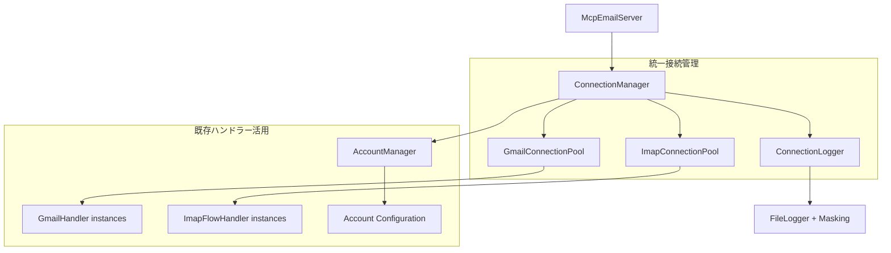
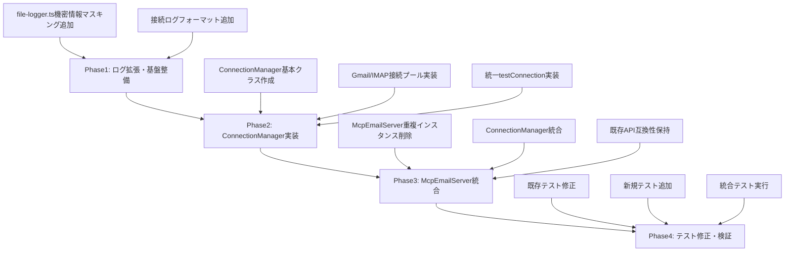

# アカウント接続一元管理設計文書

**作成日**: 2025-08-06

## 1. プロジェクト概要

### 1.1 目的・背景
Gmail/IMAP接続管理の一元化により、重複インスタンス問題を解決し、リソース効率化を実現する。現在のMcpEmailServerでは、test_connection実行時に新しいハンドラーインスタンスを作成するため、既存の接続プールと矛盾した動作が発生している。

### 1.2 成功基準
- 重複インスタンス作成の完全解消
- Gmail/IMAP接続の統一管理実現
- 既存API互換性の維持
- テスト結果の一貫性確保（health:check と npm test の整合）

### 1.3 制約条件
- **技術制約**: ESモジュール利用、既存GmailHandler/ImapFlowHandler活用
- **運用制約**: セッション毎の接続初期化、永続化なし
- **互換制約**: 既存API仕様の維持、vitest環境との整合性

## 2. 要件定義

### 2.1 機能要件

#### 2.1.1 主要機能
- **統一接続管理**: Gmail/IMAP接続プールの統一管理
  - 入力: accountName, accountType
  - 処理: プール確認 → 未接続時新規作成 → 既存時再利用
  - 出力: ハンドラーインスタンス

- **接続テスト統一**: test_connectionの統一インターフェース
  - 入力: accountName
  - 処理: アカウント種別自動判定 → 適切なハンドラー取得 → 接続テスト
  - 出力: 統一形式の接続結果

#### 2.1.2 補助機能
- **セッション管理**: 接続プールのライフサイクル管理
- **ログ記録**: 接続イベントの詳細ログ出力（機密情報マスキング付き）
- **リソースクリーンアップ**: セッション終了時の確実なリソース解放

### 2.2 非機能要件
- **性能要件**: セッション内での接続再利用によるレスポンス向上
- **保守性要件**: 既存コードパターンとの整合性維持
- **拡張性要件**: 新しいプロトコル追加への対応可能性

## 3. アーキテクチャ設計

### 3.1 システム構成



### 3.2 技術スタック
- **コア言語**: TypeScript (ES Modules)
- **既存活用**: GmailHandler, ImapFlowHandler, AccountManager
- **ログ基盤**: 既存FileLoggerシステム拡張
- **テスト**: vitest環境

### 3.3 データフロー

```
1. McpEmailServer起動 → ConnectionManager初期化 → 空プール作成
2. ツール実行要求 → ConnectionManager.getHandler(accountName)
3. プール確認 → 未接続なら新規作成 → プールに保存
4. ハンドラー取得 → 既存メソッド実行
5. セッション終了 → ConnectionManager.cleanup() → 全接続破棄
```

## 4. 詳細設計

### 4.1 コンポーネント設計

#### 4.1.1 ConnectionManager
- **責務**: Gmail/IMAP接続の統一管理、プールライフサイクル制御
- **インターフェース**:
```typescript
interface ConnectionManager {
  getGmailHandler(accountName: string): Promise<GmailHandler>;
  getImapHandler(accountName: string): Promise<ImapFlowHandler>;
  testConnection(accountName: string): Promise<ConnectionResult>;
  cleanup(): Promise<void>;
  getPoolStatus(): PoolStatusInfo;
}
```
- **実装方針**: 既存ハンドラークラス活用、セッション毎初期化

#### 4.1.2 ConnectionLogger
- **責務**: 接続イベントの専用ログ記録、機密情報マスキング
- **インターフェース**:
```typescript
interface ConnectionLogger {
  logConnectionEvent(event: 'CREATE' | 'REUSE' | 'CLEANUP', accountName: string, accountType: 'gmail' | 'imap'): void;
  logConnectionError(accountName: string, operation: string, error: Error): void;
  logPoolStatus(gmailCount: number, imapCount: number): void;
}
```
- **実装方針**: 既存logToFile関数拡張、部分表示式機密マスキング

### 4.2 データ構造設計

```typescript
// 接続結果統一形式
interface ConnectionResult {
  success: boolean;
  accountName: string;
  accountType: 'gmail' | 'imap';
  message: string;
}

// プール状況情報
interface PoolStatusInfo {
  gmail: {
    active: number;
    accounts: string[];
  };
  imap: {
    active: number;
    accounts: string[];
  };
}

// 機密情報マスキング設定
interface MaskingConfig {
  partialMasking: {
    prefixLength: 4;    // 先頭4文字表示
    suffixLength: 4;    // 末尾4文字表示  
    maskChar: '*';      // マスク文字
  };
  sensitiveFields: ['password', 'refreshToken', 'encryptionKey', 'clientSecret'];
}
```

### 4.3 ログ設計

#### 4.3.1 接続ログフォーマット
```typescript
// 接続イベント例
[INFO] [CONNECTION] GMAIL CREATE kentaroh7: New connection established
[DEBUG] [CONNECTION] IMAP REUSE info_h_fpo_com: Using cached connection  
[INFO] [CONNECTION] POOL_STATUS: Gmail: 3 active, IMAP: 2 active
[ERROR] [CONNECTION] GMAIL FAILED kabucoh: Authentication failed - invalid_grant
```

#### 4.3.2 機密情報マスキング
```typescript
// マスキング例
Original: { refreshToken: "1//04abcd...xyz789", password: "secret123" }
Masked:   { refreshToken: "1//0***89", password: "secr***23" }
```

## 5. 実装計画

### 5.1 Phase分割

- **Phase 1: ログ拡張・基盤整備** - file-logger.ts機密マスキング機能追加
- **Phase 2: ConnectionManager実装** - 核心機能の実装・テスト
- **Phase 3: McpEmailServer統合** - 既存コードとの統合・重複削除
- **Phase 4: テスト修正・検証** - 既存テスト修正・動作確認

### 5.2 依存関係



### 5.3 工数見積もり

| Phase | Group | タスク数 | 工数(時間) | 並列度 | 説明 |
|-------|-------|----------|------------|---------|------|
| 1     | A     | 2        | 6          | 1       | ログ機能拡張 |
| 2     | B     | 3        | 12         | 1       | ConnectionManager実装 |
| 3     | C     | 3        | 8          | 1       | McpEmailServer統合 |
| 4     | D     | 3        | 10         | 1       | テスト・検証 |

**総工数**: 36時間  
**実行方針**: 各Phase内は順次実行（安全性重視）

## 6. リスク分析

### 6.1 技術リスク
- **既存テスト大幅修正**: test_connectionの動作変更により既存テストが影響を受ける
  - 影響度: 中
  - 対応策: Phase4で集中的なテスト修正、段階的検証

- **接続プールの競合状態**: 同時アクセス時の接続プール管理
  - 影響度: 低
  - 対応策: セッション毎初期化のため競合リスク限定的

### 6.2 運用リスク
- **クリーンアップ失敗**: セッション終了時のリソース解放漏れ
  - 影響度: 中  
  - 対応策: 確実なcleanup()実行、エラーハンドリング強化

## 7. テスト戦略

### 7.1 テスト方針
- **単体テスト**: ConnectionManager各メソッドの動作確認
- **統合テスト**: McpEmailServerとの統合動作確認
- **回帰テスト**: 既存機能の動作継続確認

### 7.2 検証項目
- 重複インスタンス作成の完全解消
- test_connectionとlist_emailsの一貫性確保
- health:checkとnpm testの結果整合性
- 機密情報マスキングの正常動作

## 8. 設計判断記録

### 8.1 主要な設計判断

#### 判断1: 接続管理方式（セッション毎初期化）
- **選択内容**: 永続化なし、セッション毎の接続プール初期化
- **根拠**: シンプル性確保、サーバーレス対応、MCPプロトコル特性に適合
- **トレードオフ**: 毎回接続初期化のオーバーヘッド
- **代替案**: 永続的接続プール（複雑性増大のため不採用）

#### 判断2: 既存ハンドラー活用
- **選択内容**: GmailHandler/ImapFlowHandler再利用
- **根拠**: 安全性確保、開発効率向上、既存バグ混入防止
- **影響範囲**: プロトコル固有実装の維持
- **移行戦略**: 段階的統合、既存API互換性保持

#### 判断3: ログシステム拡張
- **選択内容**: 既存file-logger.ts拡張（機密マスキング追加）
- **根拠**: 一貫性維持、保守性向上、既存インフラ活用
- **トレードオフ**: 機能追加による複雑性増加
- **代替案**: 新規ログシステム（開発工数増大のため不採用）

## 9. 運用・保守計画

### 9.1 監視・ログ
- **接続イベント監視**: 接続作成/再利用/エラーの記録
- **プール状況監視**: アクティブ接続数の定期記録
- **機密情報保護**: 自動マスキング機能による情報漏洩防止

### 9.2 保守性考慮
- **統一インターフェース**: 新プロトコル追加への拡張性確保
- **既存パターン踏襲**: コードベース一貫性維持
- **段階的移行**: 安全な機能移行とロールバック可能性

---

**設計承認**: 2025-08-06  
**実装開始承認**: ユーザー確認済み